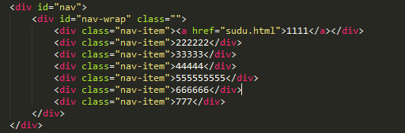

## swipe1/swipe2 图片滑动切换  

使用很简单   

var less = new Lunbo({  
	idname:'less' ,  
	top:'top' ,  
	autoPlay:false ,  
	loop:true ,  
	keyEvent:true ,  
	buttPrev:'buttPrev' ,  
	buttNext:'buttNext'  
    })
 
  

* **idname** : id名【bitch】 

* **top** : 上下滑动还是左右滑动两个值【top/left】
  
* **autoplay** : 是否自动滑动
  
* **loop** : 是否循环滑动
  
* **dianNav** : 要不要出现导航小点
  
* **keyEvent** : 可使用上下左右按键来切换页面  

* **callback** : 回调函数，页面滑动解后执行，Lunbo会给其传递一个参数【currentPage】，表示当前页码

* **buttPrev** :  传递id，点击切换到下上一页

* **buttNext** : 传递id，点击切换到下一页  

## swipe-real   

*其效果类似于浏览器的上下滑动，会检测滑动速度，等到滑动结束时表现出【惯性】效果 
  
####使用  

*swipeReal(idname,direction);  

   

* **idname** : id名   

* **direction** : 上下滑动还是左右滑动两个值【top/left】  

